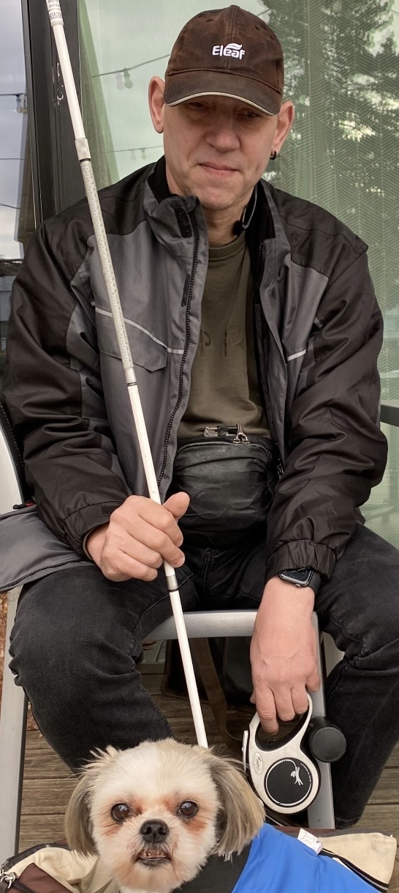

+++
title = "Dank Voiceover unabhängig sein"
date = "2023-03-26"
draft = false
pinned = false
image = "microsoftteams-image-10-.png"
description = "Welchen Nutzen hat die Sprache für die Blindheit? Wie man eine Person ansprechen sollte, die Kommunikation mit seinem Hund, Voiceover und die heutige Technik, all dies hilft zur Unabhängigkeit. "
footnotes = "Verfasserin: Deborah M."
+++


*Martin Schaub ist 51 Jahre alt und wohnt in Jegenstorf. Er hat seine Sehbeeinträchtigung seit Geburt an und laut augenärztlichem Attest hat er eine 25-prozentige Sehkraft. Er ist Mitglied des Blindenbundes. Früher arbeitete er als Velo-/Motorradmechaniker und momentan arbeitet er als Laufradmonteur in Liebefeld.* 


> Wenn ich halt erschrecke, erschrecke ich
>
> Eine blinde oder sehbeeinträchtigte Person sollte die Hilfsperson am Arm nehmen und nicht andersrum
>
> Wenn man es kann, ist es einfach
>
> Für dies sehe ich leider zu gut

**Am Bahnhof wusste ich nicht genau, wie ich Sie ansprechen sollte. Weil ich mir dachte, wenn ich Sie berühren würde, könnten Sie erschrecken und deswegen wollte ich Sie fragen, wie Sie es mögen, von anderen Personen angesprochen zu werden?**

Ich hörte zu viel meinen Namen und habe zu oft zurückgeschaut, mittlerweile mache ich dies nicht mehr. Ich finde, man sollte mir besser auf die Schulter klopfen, wenn ich halt erschrecke, erschrecke ich.

**Dementsprechend war dies eine komische Situation oder gibt es noch eine weitere komische oder eher lustige Situation, welche Ihnen gerade in den Sinn kommt?**
Ja also eine lustige Situation, eher eine ärgerliche Situation, bei welcher andere Personen mich plötzlich am Arm nehmen und mich in eine Richtung ziehen. Dies ist eine falsche Herangehensweise. Eine blinde oder sehbeeinträchtigte Person sollte die Hilfsperson am Arm nehmen und nicht andersrum.

**Somit könnte es auch sein, dass Sie wie in die falsche Richtung geführt werden?**
Ja und Ablenkung ist für blinde-/sehbeeinträchtigte Personen immer ein Problem, denn die Blinden stellen sich ihren Weg wie eine Karte vor und dann ist es so wie, man einer Person beim Autofahren das GPS abstellen würde.

**Das letzte Mal ist mir aufgefallen, dass Sie einen kleinen Hund haben, welchen Sie auch jetzt wieder bei sich haben und da kam mir die Frage, wie Sie sich mit ihrem Hund verständigen. Zum Beispiel wie Sie merken, wenn er Schmerzen hat, denn ich habe selbst auch ein Hund und dieser zeigt dies oft mit Gesten oder nonverbal an.**
Also Gesten von meinem Hund kann ich schon lesen. Ich sehe nicht so schlecht, dass es mir nicht auffallen würde und Befehle gebe ich in verschiedenen Sprachen, weil wenn fremde Personen meinem Hund einen Befehl geben würden, geben Sie diesen meistens in Mundart, beispielsweise «Fuss» und für einen Blindenführhund braucht man das Wort «Piede», also sage ich «Piede», dass mein Hund unterscheiden kann, wer einen Befehl gibt.

**Es ist aber keine typische Blindenhundrasse…**
Nein, also bis jetzt hörte ich noch nie, dass Shih tzu ein Blindenführhund sei.

**Aber er kann Ihnen trotzdem auf eine gewisse Art helfen?**
Ja also, wenn er merkt, dass ich unsicher laufe, fängt er an mich zu führen. Ich bin glücklich, dass er sich dies selbst beigebracht hat, Hunde haben ein gutes Gedächtnis.

**Am Bahnhof ist mir auch aufgefallen, dass Sie sehr zielstrebig unterwegs gewesen sind. Verwenden Sie eine App, damit Sie sich besser im Verkehr zurechtfinden?** 
Wenn ich mich nicht zurechtfinde, verwende ich Google Maps.

**Wie wenden Sie denn Google Maps an?**
Ich habe ein I-Phone und I-Phone hat automatisch auch Voiceover. Dies ist aber etwas anderes als Siri. Beim Voiceover kann man mit Fingergesten auf dem Display navigieren. 

**Das hilft auch für mehr Unabhängigkeit?**
Ja, und es ist etwas anderes als das Siri. Bei Siri kann man mit der Sprache Befehle geben, welches Voiceover auch mit Fingergesten kann. Man tippt zwei Mal aufs Display und dann öffnet es eine App. Wenn man es kann, ist es einfach.

**Benutzen Sie auch einen Screenreader, denn ich las über ihn und dieser liest dem Anwender Texte vor, oder ist dies etwas ähnliches wie das Voiceover?** 
Screenreader habe ich keinen, aber auf meinem Computer habe ich eine Sprachausgabe.

**Und wie ist es bezüglich den E-Mails?** 
E-Mails kann ich mir beispielsweise über das Voiceover beim Handy oder auch auf dem Computer zu Hause vorlesen lassen.

**In Bezug auf Technik, wie hat sich dort etwas verändert, gibt es mehr Möglichkeiten sich zurecht zu finden?**
Ja, es gibt sehr viel Möglichkeiten, es gäbe auch eine Kamera, welche man an einer Brille hat und wenn man beispielsweise Einkaufen geht und Sie haben ein Produkt in der Hand, bei welchen die Angaben meistens sehr klein geschrieben sind, dann würde Ihnen die Kamera dies vorlesen.

**Und dies benutzen Sie auch oder nicht?**
Nein, das habe ich nicht. Für dies sehe ich leider zu gut. Das ist auch immer ein Kriterium, alle Hilfsmittel bekomme ich beispielsweise nicht, weil manche würde ich erst bekommen, wenn ich noch weniger sehen würde, als das ich jetzt eigentlich sehe.