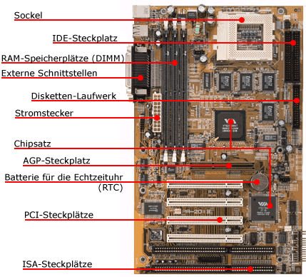

+++
title = "Innenleben eines Computers "
date = "2023-06-06"
draft = false
pinned = false
image = "mainboard.gif"
+++

**Fragestellung:**
Welche Teile enthält ein Computer?

**Idee:**
Mich interessiert es wie ein Computer aussieht und wie er zusammengebaut ist. Deswegen möchte ich einen alten Computer auseinandernehmen, danach im Internet recherchieren und die jeweiligen Teile beschriften. 

**Vorgehen (Planung):**
Von der Schule wurde mir ein HP Computer zur Verfügung gestellt, wie auch ein Werkzeugkasten. Im Werkzeugkasten befanden sich verschiedene Schraubenzieher-Aufsätze. Es war eine Herausforderung den passenden Schraubenzieher für die richtige Schraube zu verwenden. Danach habe ich alle Komponenten auseinandergenommen. Schlussendlich recherchierte ich im Internet, welche Teile sich in einem Computer befinden und ordnete ihnen einen passenden Begriff zu.